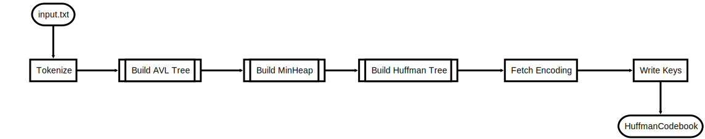
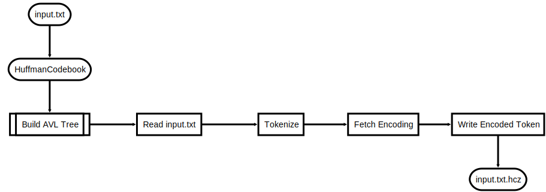
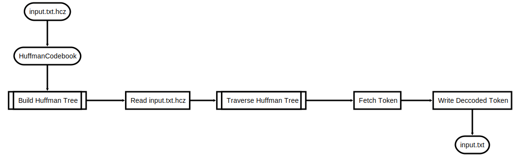

# File Compression (CS214 // Assignment 2)
#### Contributors: Seth Karten & Yash Shah

## Overview
In this assignment, we were asked to design a program which uses Huffman Codes to compress and decompress files. The assignment's primary objective served to help us learn and use the file system interface to read files and directories. Using the `readdir()` and `opendir()` functions, we were able to recursively explore the entire directory tree and eventually use `open()` and `read()` functions to read and analyze the contents of each file. 

This assignment consists of three major parts: (1) building the codebook using Huffman codes on tokens read from files, (2) compressing the files, and (3) decompressing the compressed files.

## Building the Codebook

When building the codebook, we used three primary data structures in our implementation to optimize the process:

- AVL Tree
- MinHeap
- Huffman Tree

The `build_codebook` routine performs the following operations:



We start the build proces by using the AVL tree to store tokens. We use the AVL tree for the `O(log(n))` time complexity it provides for insertion and lookup operations. This reduces our overhead as we can quickly append items from a file buffer without having repeated elements, while being able to count the frequency of each token occuring.

Next, we build a MinHeap by traversing through this AVL tree of elements with the priority factor as the frequency of occurence of each token. The MinHeap's `O(log(n))` time complexity allows us to quickly sort the tokens to prepare them for encoding using Huffman Codes as it serves as an ordered list of tokens.

FInally, we build the Huffman Tree as it's structure allows us to quickly determine each token's encoding string. As we traverse through the entire tree, we keep track of left/right moves and build up the encoding string until we reach a leaf node. This operation gives us an `O(n)` time complexity for encoding keys as we only ever visit each token once. 

## Compressing Files

When compressing files, we used only the AVL Tree to optimze the process. We leveraged the AVL tree's `O(log(n))` time complexity for lookups when searching the encoding string for each token found in the file.

The flowchart outlines the compression process:



We start by building an AVL tree from the `HuffmanCodebook` file which stores all available tokens and their respective encodings. After that, we iterate through the input file to fetch all tokens to compress, and lookup their respective encodings for each token, and write them, in order, in the compressed file. 

## Decompressing Files

When decompressing fies, we employed the Huffman Tree to optimize the process. We leveraged the fact each encoding string reflected left/right moves for the binary tree when we searched for the token that was originally stored.

The flowchart outlines the decompression process:



We begin the decompressing process by reading the `HuffmanCodebook` file and loading its contents into a Huffman Tree. As previously stated, this data structure allows us to treat the encoding string as instructions for traversing the binary tree until we reach a token. This allows us to achieve a time complexity of `O(n)`, where `n` is the number of bits in the encoded string. Once we decode a token, can write it to the original file. 

## Recursive Operations

Another significant component of this assignment required traversing through directories and being able to manipulate files and subdirectories that exist within them. Hence, a recursive approach was applied to fetch all eligible files for the operation and appended to a LinkedList. We used a Linked List because of it's simplicity in storage, as well as it's ability to easily traverse the list at the end. 

We defined the following struct to store each item in the Linked List:
```
typedef struct _FileNode {
	char * file_path;
	struct _FileNode * next;
} FileNo
```

We ensured that we modularized our program for each operation, and this allowed us to iterate through this linked list of files and call compress/decompress on each of these files. As a result, whenever our program receives a recursive file, it fetches files, and iterates through the files and calls the operation requested on that file.

However, during the build process, rather than invoking the entire process of building the codebook, we split up the process into two:
- Building the AVL Tree of tokens
- Building the Huffman Tree to fetch encoding & writing the keys to a file

By doing this, we optimized our program by ensuring that we accounted for all tokens that exist in all files within that directory, and only performing the encoding process once. 

For safety, we ensured that the input received by our program is a valid directory path using `stat`. If it is not found to be a directory, we simply inform the user that the flag requires a directory input and cleanly exits.


## Implementation Notes

## Testing & Instrumentation
